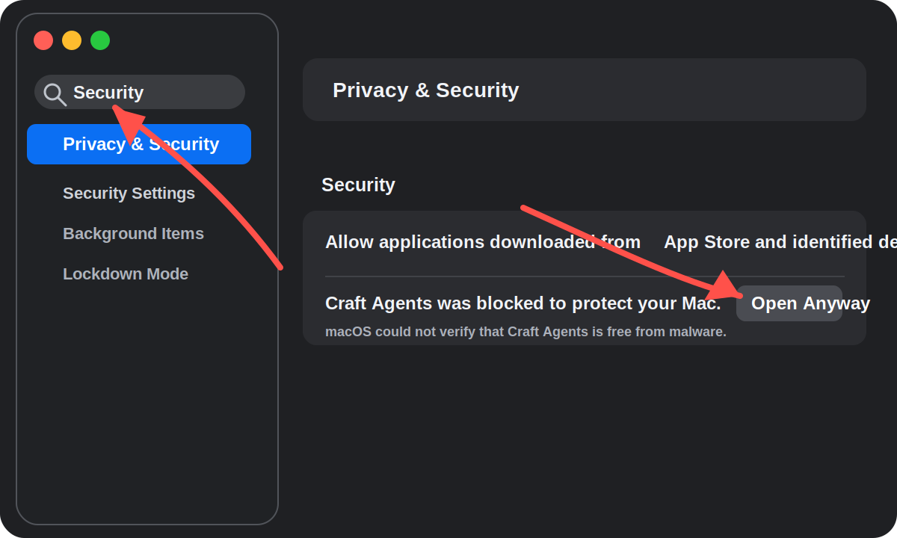

# Craft Agents OSS

[](LICENSE)

Craft Agents OSS is a Bun monorepo for a desktop and headless AI-agent workspace. The main product is an Electron app that combines chat sessions, local workspaces, sources, skills, file editing, diff review, automations, and writing-project workflows.

This repository is currently optimized for source development, local packaging, and custom workspace workflows. It is not only a thin Claude wrapper: it includes a shared RPC server, a Pi SDK subprocess adapter, reusable UI packages, a web client, a session viewer, and writing method-pack scaffolds.

## What This Project Provides

- **Electron desktop app** for multi-session agent work, source management, file editing, local diff review, and workspace navigation.
- **Headless server** that keeps sessions and tools running remotely over WebSocket.
- **CLI client** for scripting against a headless server.
- **Shared UI and protocol packages** used by Electron, web UI, and viewer surfaces.
- **Multiple agent backends** through Anthropic Claude Agent SDK and Pi SDK based provider integrations.
- **Writing workspace mode** with Markdown editing, file mentions, line numbers, total character counts, inline selection rewrite, export, local version snapshots, and diff review.
- **Writing method packs** for Claude-Book, Oh Story, Crucible, and general creative-writing scaffolds.
- **Sources and skills** for MCP servers, REST APIs, local files, workspace-specific instructions, and agent-native integrations.

## Repository Map

```text
craft-agents-oss/
├── apps/
│   ├── cli/                 # Terminal client for the headless server
│   ├── electron/            # Primary desktop app: main, preload, renderer
│   ├── viewer/              # Shared session transcript viewer
│   └── webui/               # Browser client for the headless server
├── packages/
│   ├── core/                # Shared low-level types and utilities
│   ├── messaging-gateway/   # Messaging gateway integration
│   ├── messaging-whatsapp-worker/
│   ├── pi-agent-server/     # Out-of-process Pi SDK adapter
│   ├── server/              # Standalone headless server entry
│   ├── server-core/         # RPC transport, reusable handlers, platform contracts
│   ├── session-mcp-server/  # Bundled MCP server used by sessions
│   ├── session-tools-core/  # Tool implementations shared by runtime surfaces
│   ├── shared/              # Config, protocol, sessions, sources, writing logic
│   └── ui/                  # Shared React UI, Markdown, diff, chat components
├── docs/
│   ├── assets/              # Documentation images and diagrams
│   └── plans/               # Design and implementation planning notes
├── scripts/                 # Build, validation, release, and maintenance scripts
└── README.md                # Project overview and development entry point
```

## Requirements

- [Bun](https://bun.sh/) 1.2 or newer.
- Git.
- Node-compatible native tooling required by Electron packages.
- Python 3 only for document-tool smoke tests.
- Platform-specific build tools if you package Electron installers.

The project uses Bun workspaces. Use `bun`, not npm or pnpm, for install, test, build, and script execution.

## Quick Start

```bash
git clone https://github.com/JiuZhou-ailab/craft-agents-oss.git
cd craft-agents-oss
bun install
bun run electron:dev
```

For a production-like local run:

```bash
bun run electron:start
```

`electron:start` builds the Electron main process, preload scripts, renderer, bundled resources, and then launches the app.

## Common Development Commands

| Command | Purpose |
| --- | --- |
| `bun install` | Install workspace dependencies |
| `bun run electron:dev` | Start the Electron app in development mode |
| `bun run electron:start` | Build and run the Electron app |
| `bun run electron:build` | Build Electron main, preload, renderer, resources, and assets |
| `bun run electron:dist:dev:mac` | Build an unsigned development macOS package through the runtime-staged packaging path |
| `bun run release -- --platform=darwin --arch=arm64` | Run version checks, CI validation, and a runtime-staged local package build |
| `bun run server:start` | Start the standalone headless server |
| `bun run server:dev` | Start the headless server with debug settings |
| `bun run webui:dev` | Start the browser client |
| `bun run viewer:dev` | Start the session viewer |
| `bun run typecheck:all` | Typecheck all major packages and apps |
| `bun test` | Run Bun tests |
| `bun run validate:ci` | Run the broader validation suite |
| `bun run lint:i18n:coverage` | Check that literal i18n keys exist |

## Desktop App

The Electron app lives in `apps/electron`.

Important paths:

```text
apps/electron/src/main/       # Main process, app lifecycle, windows, local handlers
apps/electron/src/preload/    # Context bridges exposed to renderer
apps/electron/src/transport/  # Channel map and RPC client bridge
apps/electron/src/renderer/   # React UI, shell, chat, writing workspace
apps/electron/resources/      # Runtime scripts and packaged resources
```

Useful commands:

```bash
bun run electron:build:main
bun run electron:build:preload
bun run electron:build:renderer
bun run electron:build
bun run electron:start
```

Logs in development are written under the Electron log directory, usually:

```text
~/Library/Logs/@craft-agent/electron/main.log
```

## Writing Workspace

Writing projects are first-class workspaces. They support:

- Method-pack based project scaffolds.
- Markdown manuscript editing with line numbers and total character count.
- Writer-facing file labels for chapter and planning files.
- `@file` mentions by display name while preserving the real file path.
- Inline selection rewrite that edits the active document instead of routing through the normal chat transcript.
- Inline diff review for generated file changes.
- Export controls for manuscript, outline, state, timeline, style, work, and analysis files.
- Local git-backed version snapshots from the version-history button near export.

Built-in method packs live in:

```text
packages/shared/src/writing/method-packs/
```

The scaffold and writing project logic live in:

```text
packages/shared/src/writing/
packages/shared/src/workspaces/
apps/electron/src/renderer/components/writing/
```

## Headless Server

The standalone server runs agent sessions and tools without the Electron UI.

```bash
CRAFT_SERVER_TOKEN=$(openssl rand -hex 32) bun run server:start
```

Common environment variables:

| Variable | Required | Default | Description |
| --- | --- | --- | --- |
| `CRAFT_SERVER_TOKEN` | Yes | - | Bearer token for client authentication |
| `CRAFT_RPC_HOST` | No | `127.0.0.1` | Bind address |
| `CRAFT_RPC_PORT` | No | `9100` | Bind port |
| `CRAFT_RPC_TLS_CERT` | No | - | PEM certificate path for `wss://` |
| `CRAFT_RPC_TLS_KEY` | No | - | PEM private key path |
| `CRAFT_DEBUG` | No | `false` | Enable debug logging |

Connect the Electron app to a remote server with:

```bash
CRAFT_SERVER_URL=ws://127.0.0.1:9100 \
CRAFT_SERVER_TOKEN=<token> \
bun run electron:start
```

## CLI Client

The CLI lives in `apps/cli` and talks to the headless server.

```bash
bun run apps/cli/src/index.ts --help
bun run apps/cli/src/index.ts --url ws://127.0.0.1:9100 --token <token> ping
```

Typical commands include:

```bash
bun run apps/cli/src/index.ts workspaces
bun run apps/cli/src/index.ts sessions
bun run apps/cli/src/index.ts send <session-id> "Summarize this workspace"
bun run apps/cli/src/index.ts run --workspace-dir . "Inspect this repository"
```

## Runtime Data

Local user data is stored under:

```text
~/.craft-agent/
├── config.json
├── credentials.enc
├── preferences.json
├── workspaces/
└── sessions/
```

Writing workspaces may also contain their own project files, skills, `craft-writing.json`, `craft-pack-lock.json`, and a local `.git` directory for version snapshots.

## LLM Providers

The project supports multiple connection types through two runtime paths:

- **Claude backend**: Anthropic Claude Agent SDK, Anthropic API key, Claude Max/Pro OAuth, and compatible custom endpoints.
- **Pi backend**: Pi SDK based connections for Google AI Studio, ChatGPT/Codex OAuth, GitHub Copilot OAuth, OpenAI API keys, and related provider flows.

Connection configuration is stored in the user config and credential store, not in repository source.

## Sources, Skills, and Automations

- **Sources** connect external systems such as MCP servers, REST APIs, local files, and service integrations.
- **Skills** are workspace-scoped instructions and workflows that can be mentioned in chat.
- **Automations** can create or update sessions based on labels, schedules, tool events, permission changes, and session lifecycle events.

Most shared logic for these systems is in `packages/shared/src`, with reusable server handlers in `packages/server-core/src/handlers/rpc`.

## Validation Strategy

Use focused checks while developing:

```bash
bun test path/to/test.ts
cd apps/electron && bun run typecheck
cd packages/shared && bun run tsc --noEmit
```

Use broader checks before release:

```bash
bun run check-version
bun run typecheck:all
bun run validate:ci
bun run electron:build
```

For packaging:

```bash
bun run electron:dist:dev:mac -- --arch=arm64
bun run electron:dist:dev:mac -- --arch=x64
bun run electron:dist:dev:win
```

Current GitHub releases publish only macOS `.dmg` and Windows `.exe` artifacts. macOS artifacts are architecture-specific: Apple Silicon Macs require `Craft-Agents-arm64.dmg`, Intel Macs require `Craft-Agents-x64.dmg`, and the Electron runtime requires macOS 12.0 or newer. Opening the wrong macOS artifact, or running on macOS 11 or older, can produce the system message that this Mac does not support the application.

### macOS Security Warning

Until the macOS app is signed with a Developer ID certificate and notarized by Apple, macOS Gatekeeper may show a warning that Apple cannot verify whether Craft Agents contains malware or may harm privacy. Only use the steps below for Craft Agents downloads from the official GitHub release page.



To open the app:

1. Open `System Settings`.
2. Search for `Security`, then open `Privacy & Security`.
3. Scroll to `Security`.
4. Find the blocked `Craft Agents` entry.
5. Click `Open Anyway`, then confirm.

The long-term distribution fix is Developer ID signing plus Apple notarization. This manual approval step is only a temporary workaround for unsigned or non-notarized builds.

The root packaging scripts call the platform build scripts under `apps/electron/scripts` so runtime assets such as bundled `uv`, Bun, SDK binaries, ripgrep, and helper subprocesses are staged before `electron-builder` runs. Direct `electron-builder` commands from the repository root are not the release path.

For the full local release gate:

```bash
bun run release -- --platform=darwin --arch=arm64
```

## Development Notes

- Keep Electron IPC/RPC channels declared in `packages/shared/src/protocol`, mapped in `apps/electron/src/transport`, typed in `apps/electron/src/shared/types.ts`, and registered in the appropriate handler package.
- Some system handlers exist in both reusable `server-core` and Electron-local GUI/main-process layers. When adding runtime channels, verify both registration paths when applicable.
- Keep generated or runtime-only files out of commits, especially `.playwright-mcp/`, packaged `dist/` output, logs, and local credentials.
- Use local helper packages and existing abstractions before adding new dependencies.
- Root documentation should stay aligned with actual package layout and supported commands.

## License

This project is licensed under the Apache License 2.0. See [LICENSE](LICENSE).

Third-party SDKs and services may have their own terms. In particular, Claude Agent SDK usage is subject to Anthropic terms, and Pi SDK/provider usage is subject to the relevant provider terms.
