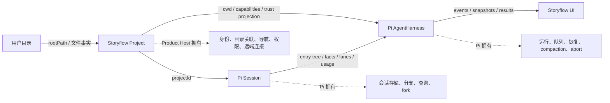
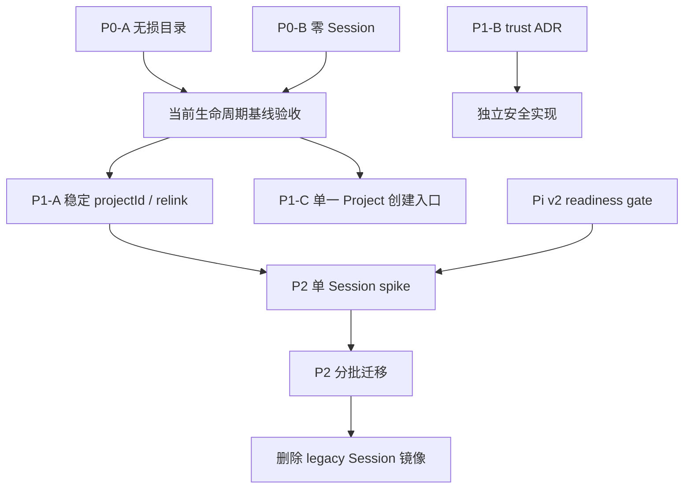

# PRD: Project 与 Session 生命周期按 Pi v2 收敛

状态：P0、P1 已完成；Pi v2 迁移由 readiness gate 阻塞
日期：2026-08-25（2026-08-26 完成 P1 与 gate 复核）
关联决策：ADR 0007、ADR 0011、ADR 0018、ADR 0020

## 1. 产品结论

Storyflow 的产品主语是用户的 Project，而不是运行时 Workspace 或 Agent Session：

- **Project** 是用户拥有的真实目录，加一条由 Product Host 管理的稳定注册记录。
- **Session** 是用户显式开始的一次任务/对话，可以在 Project 内为零个、一个或多个。
- **Agent Runtime** 只在 Session 运行时附着；它不拥有 Project，也不决定 Project 是否存在。
- **cwd** 是本次运行的目录定位信息，不是 Project 或 Session 的身份。

因此，选择目录创建项目后，系统只注册并打开 Project；不得删除或重建已有目录，不得自动创建空
Session。Pi v2 成熟后，Session 的树、facts、lanes、usage ledger 和恢复状态交给 Pi；Storyflow 只保留
项目身份、导航、权限、内容能力和跨端 Host 契约。

## 2. 当前问题与根因

| 当前行为 | 根因 | 风险 |
|---|---|---|
| 重新选择默认项目目录中的未跟踪 Workspace 时递归删除整个目录 | CREATE RPC 把“未被全局配置跟踪”误判为“可安全重建” | 用户文件不可恢复，P0 数据安全问题 |
| 创建 Project 后立即创建并选择一个 Session | Project 创建与 Session 创建被压成一个 UI 事务 | 空任务污染历史，Project 无法独立存在 |
| 全局 Workspace 记录、目录内 WorkspaceConfig 和 rootPath 同时参与身份判断 | “身份”与“当前位置”未显式分离 | 移动目录、重新关联和去重行为不稳定 |
| Project 文件可声明默认 `allow-all`、自动 Sources、stdio MCP 与 Automations | 注册目录被误当作授予执行能力 | 陌生目录可扩大工具权限、启动子进程或后台动作 |
| 当前生产运行时仍使用 `createAgentSession` 与 `PiSessionManager` | Pi v2 `AgentHarness` 的关键 operation 仍是 scaffold | 现在迁移会把未实现路径带入生产 |

前两项违反 ADR 0007 已接受的无损冷启动契约，应立即修复。后两项需要依赖治理与独立迁移，不应
混进数据安全补丁。

## 3. 第一性原理约束

1. 用户目录的所有权高于应用便利性。添加、打开、重新关联都不能隐式删除、清空、搬移或覆盖目录。
2. Project、Session、Runtime 是三个正交生命周期；任何一个的创建不得暗含另一个的创建。
3. 稳定身份不能由可变路径承担；路径只回答“现在在哪里”。
4. Runtime 状态只允许一个事实源。迁移到 Pi v2 后，不保留 Storyflow 自制的第二套树、恢复状态或
   usage ledger。
5. 不针对未完成 API 编写兼容层。readiness gate 未通过时继续使用已验证的 Pi v1 公共路径。
6. 信任是 capability 维度，不是 Project 存在状态。权限扩张、自动 Sources、stdio MCP、Automations
   与项目级可执行 Extension 分别授权，不能引入一个笼统的 trusted/untrusted Project 枚举。

## 4. 责任边界

内部代码可暂时继续使用 `Workspace` 命名；在生命周期和产品文案中统一称 Project。仅为改名而进行
全仓机械重构没有用户价值，不属于本 PRD。

## 5. 目标用户行为

### 5.1 添加普通目录

1. 用户选择目录。
2. Host 校验路径与访问权限。
3. 目录没有 Storyflow 隐藏状态时，只创建运行必需的 `.craft-agent` 隐藏状态；保留所有已有文件。
4. Host 创建 Project 注册记录并进入 Project。
5. Project 初始 Session 数量为 0；用户点击“新建任务”后才创建 Session。

### 5.2 重新添加已有 Storyflow Project

1. 读取并复用已有隐藏状态。
2. 不因该目录未出现在全局注册表中而清空或重建目录。
3. 不自动改写已有 Project 名称；重命名走显式命令。
4. 注册完成后进入 Project，保留其已有 Session 列表。

### 5.3 Project 无 Session

Project 页面、真实文件树、导入、新建文件和选择 Skill 均可使用；Session 列表显示空态。空态不是
异常，也不触发修复 Effect。

### 5.4 移除与删除

“移除 Project”只删除 Host 注册和 Host 私有缓存，不删除用户目录。未来若增加“移到废纸篓”，必须
作为单独、明确确认且可恢复的命令，不能复用移除入口。

## 6. 需求与验收

### P0-A：添加已有目录必须无损

- CREATE RPC 不存在对用户所选 Project 根目录的递归删除路径。
- 默认目录与自定义目录遵循同一无损规则。
- 已有 `.craft-agent/config.json` 与普通文件保持原内容。
- 回归测试在默认目录中放置 `keep.md`，重新添加后文件仍存在，原配置名称不被隐式改写。

### P0-B：Project 创建不再隐式创建 Session

- 创建成功后进入 Project 的 writing route。
- 创建回调不调用 `handleCreateSession` 或 `handleSelectProjectSession`。
- 新 Project 的 Session 列表允许为空。
- 显式“新建任务”入口保持可用。

### P1-A：Project 身份与位置分离

- 全局 Project 注册记录的 `id` 是 Product Host 的 canonical `projectId`。
- `rootPath` 是可更新 locator，不再承担身份职责。
- 目录内旧 `WorkspaceConfig.id` 只作为兼容元数据读取，不用于自动合并两个注册记录；复制目录不能
  复制 Host 身份。
- 目录丢失时提供显式 relink：用户选择新目录后更新同一 `projectId` 的 `rootPath`，Session 归属不变。
- 同一路径已归属另一 Project 时拒绝 relink，并给出可操作错误；不自动合并历史。

### P1-B：信任边界独立审计

- Project 注册、文件读取、Skill 发现和可执行 Extension 授权分别建模。
- 保留 ADR 0018：项目 Skills 可只读发现，项目可执行 Extensions 未经 Host 显式授权不得执行。
- Project 文件不能自我授予权限扩张、默认 `allow-all`、自动启用 Source 或 stdio MCP。
- Project Automations 默认不启动；只有 Host 设置中的独立授权可启动 prompt、webhook 与 scheduler。
- 不增加类似 Claude Code/Codex 的笼统“信任整个目录”；具体能力授权由 ADR 0020 约束。

### P1-C：Project 创建入口单一化

- 桌面端自选目录与 headless/server 托管目录都通过 `registerLocalProject` 建立目录状态和 Host 注册。
- `addWorkspace` 只持久化 Host 注册，不检查、创建或修复 Project 根目录。
- 两个 CREATE RPC 都在 Host SessionManager 初始化 gate 完成后注册 Project，并按同一顺序加载该 Project 的
  Session 元数据、启动 config watcher、设置 active Project。
- server 托管目录的唯一名称分配在初始化 gate 后同步完成，避免并发请求在等待期间预选同一路径。

### P2：迁移到 Pi v2

- Pi `SessionRepo` 拥有 Session 的 create/open/list/delete/fork/search。
- Pi Session 拥有 entry tree、application facts、lanes 和 usage ledger。
- Pi `AgentHarness` 拥有 prompt/resume/queue/abort/compact/navigation 与崩溃恢复。
- Storyflow 用 application-scoped fact 记录 `projectId`，用 Host 注册表解析当次 cwd 和 capabilities。
- Storyflow UI 只投影 Pi 公共 event/snapshot/result；不得复制 operation state machine。
- 迁移完成后删除对应的 legacy SessionManager 镜像代码，不做长期双写。

## 7. Issues 重组与优先级

现有宽泛的“对齐 Claude Code/Codex/Pi”或“升级 Pi v2”议题应拆成以下可独立验收的 issues。不要为每个
内部类创建 issue；一个 issue 只保护一个用户可见不变量或一个迁移关口。

| 顺序 | Issue | 状态 | ROI / 依赖 |
|---:|---|---|---|
| 1 | P0：重新添加 Project 永不删除所选目录 | 已完成 | 最高；数据安全；无依赖 |
| 2 | P0：创建 Project 后保持零 Session | 已完成 | 高；消除错误领域耦合；无依赖 |
| 3 | P1：稳定 `projectId` 与显式 relink | 已完成 | 高；是 Session 迁移前置 |
| 4 | P1：Project capability trust 审计与高风险入口收敛 | 已完成 | 权限、Source、MCP、Automation 均改为 Host 授权 |
| 5 | P1：桌面端与 headless Project 创建入口单一化 | 已完成 | 消除 Host 注册与目录初始化双入口 |
| 6 | P2 Gate：验证 Pi v2 production readiness | 阻塞（2026-08-26 复核） | 等待 upstream 完成公共运行契约 |
| 7 | P2 Spike：单 Session 迁移与事件投影 | 被 6 阻塞 | 用真实 API 消除未知数 |
| 8 | P2 Rollout：批量迁移并删除 legacy 镜像 | 被 7 阻塞 | 只在 spike 验收后执行 |

以下 issue 方向应关闭或改写：

- “创建 Workspace 时自动初始化一个对话”：与 ADR 0007 冲突，关闭。
- “现在直接替换为 AgentHarness v2”：改为 readiness gate，不能把 scaffold 接入生产。
- “新增 RuntimeContext/ProjectSessionManager 抽象”：没有第二实现或稳定差异，删除。
- “用 cwd 作为 Session/Project ID”：身份与位置混淆，拒绝。
- “创建 Project 时统一信任所有本地资源”：把正交 capability 压成一个布尔值，拒绝。

## 8. 依赖关系与关键路径

关键路径是 `P0 基线 → projectId/relink → Pi v2 gate → 单 Session spike → rollout → 删除 legacy`。
Trust 审计与关键路径正交，可以独立进行，但不能与同一安全配置文件并行写入。

## 9. 本轮执行与并行决策

| 子任务 | 范围 | 输入 | 输出 | 并行判断 |
|---|---|---|---|---|
| Project 身份消费者盘点 | 全局注册、目录配置、Session persistence | 真实定义与调用方 | stable ID / locator / collision 约束 | 只读并行：边界独立 |
| capability trust 审计 | Permission、Source、MCP、Extension、Automation | 现有 trust 契约 | ADR 0020 与 fail-closed 清单 | 只读并行：边界独立 |
| Pi v2 readiness | upstream main、npm 包、JSONL tests | 官方源码与 changelog | gate 证据矩阵 | 只读并行：无共享写 |
| 实现与统一收敛 | Host registry、SessionManager、RPC、Electron UI、文档 | 三份审计输出 | P0/P1 代码与一致验证 | 主 agent 串行：共享契约和写冲突高 |

并行任务只产生证据，没有写共享文件；主 agent 统一决定领域术语、修改契约、补测试并消除冲突。P2
runtime 迁移未并行启动，因为 upstream gate 是硬前置，提前写 adapter 的返工成本高于收益。

## 10. Pi v2 readiness gate

截至 2026-08-26，本仓库固定 `@earendil-works/pi-coding-agent@0.84.1`；npm 最新为 `0.84.3`
（gitHead `bfb004d4418ff05c6f909eaaab856cbe75c1fde0`），upstream main HEAD 为
`8fa7eebd235355522c8104166b4f1f959b4e2f10`。生产路径仍使用 `createAgentSession` 与
`PiSessionManager`。官方源码与 scaffold tests 均显示 `AgentHarness` 的关键 operation 仍以
`HarnessNotImplemented` 拒绝。

| Gate 证据 | 2026-08-26 结果 |
|---|---|
| prompt / resume / abort / compact / navigation / queue / watch / events | 未实现，拒绝为 `HarnessNotImplemented` |
| 已有 Session restore | `create.restore` 未实现 |
| close | 仅切换 closed 状态，尚无可恢复运行闭环 |
| JSONL v4 | 已有原子 rename、torn-tail 修复与 reopen 测试；decoder 只接受 version 4 |
| legacy migrate-on-open | 未发现公共迁移路径，不能把现有 Session 安全交给 v2 |
| 官方成熟度声明 | changelog 明确称 compile-complete scaffold，未标记 production-ready |

只有同时满足以下条件，Issue 6 才能从 blocked 变为 ready：

1. Storyflow 所需的 prompt、resume、abort、close、compact、navigation、queue 路径均不再是 scaffold。
2. Memory/JSONL（以及采用时的 SQLite）SessionRepo 通过 upstream 的原子写入、重启恢复和迁移测试。
3. 官方 changelog/文档明确标记这些公共 API 可用于生产，而非仅“compile-complete”。
4. Storyflow compatibility spike 能用公共 API 完成：创建、首轮、工具调用、崩溃恢复、branch/rewind、
   compaction、关闭后恢复、事件投影和凭据刷新。
5. spike 不需要复制 Pi 私有状态、不需要手工解释 JSONL，也不需要 v1/v2 双写。

Gate 检查只更新 issue 证据和版本矩阵，不创建长期 adapter。任一条件失败即保持当前运行时。
本次条件 1、2、3 均失败，条件 4 因而不能启动；若绕过公共 API，还会直接违反条件 5。因此没有启动
“单 Session spike”：它只能验证 scaffold 按预期报错，不能降低迁移未知数，反而会诱导 Storyflow
读取 Pi 私有 JSONL 或建立双写。

## 11. Pi v2 迁移策略

Gate 通过后先写独立 ADR 与可执行迁移计划，再进行一个真实 Session spike：

1. 固定通过 gate 的 Pi 版本，禁止浮动依赖。
2. 复制一个 legacy Pi Session 到隔离的新 repo，由 Pi 官方 migrate-on-open 路径升级；不改写原文件。
3. 写入 `projectId` application fact，并从 Host 注册表解析 cwd；验证 Project 移动后 Session 身份不变。
4. 对比用户可见消息、活动分支、usage、tool lifecycle 和恢复结果；缺失事实不得用猜测补齐。
5. 首次 v2 operation 前允许回退到原 Session；一旦 v2 产生新写入，该 Session 只前进，不再双写回 v1。
6. 单 Session 验收后再按批次迁移；每批保留只读原件和映射审计，达到退出条件后删除 legacy runtime 代码。

若 upstream 最终 API 与当前 specification 不同，以上边界不变，但具体迁移实现以届时公共契约为准；
不为今天的 scaffold 保留兼容包袱。

## 12. 发布、回滚与验证

### 本轮发布

- 无用户目录数据迁移、无依赖升级；全局 Host registry 只增加可选 capability 字段，旧配置默认
  fail-closed，无需批处理迁移。
- 无损目录修复只删除破坏性行为，不需要 feature flag。
- 零 Session 是 ADR 0007 已接受行为，通过发布说明告知用户从“新建任务”显式开始。
- Project 移动后通过显式 relink 更新 locator，保留同一 `projectId` 与 Session 归属。
- Project 的 execute 默认值、自动 Sources、stdio MCP 与 Automations 改由 Host registry 授权。

### 本轮回滚

- 代码可回滚，但不得恢复递归删除目录的旧逻辑。
- 若创建后路由出现问题，只修复 Project 导航；不能用自动创建 Session 掩盖空 Project 状态。

### 必须通过的证据

- `workspace.create-handler.test.ts`：默认目录已有文件与配置不被清空。
- `workspace.create-handler.test.ts`：headless CREATE 通过 canonical registry，并补齐 init、Session reload、
  watcher 与 active Project 生命周期。
- `workspace-creation-request.test.ts`：创建回调进入 Project 且不创建 Session。
- `project-registry.test.ts` 与 `project-root-rebind.test.ts`：低层 Host 注册不初始化目录；stable ID、路径重绑定、
  同路径替换/复制/碰撞拒绝、Session locator rebase，且失败写入不会污染新 locator；无 fingerprint 的旧记录
  只能通过用户显式选择同一路径完成绑定，catalog 读取不得迁移目录状态。
- capability tests：Project 权限文件、项目来源的 stdio MCP 与 Automations 未经 Host 授权均
  fail-closed；用户级全局 stdio Source 不受 Project 授权影响。
- lifecycle tests：同一 Project 的 create/import/relink/delete/remove 串行；relink 期间旧 runtime 立即失效，
  Host commit 失败不会丢失内存 Session，commit 后 watcher 失败也不会回滚已成功的 locator。
- trust-boundary tests：Project state、Session 与 Source 路径遇到 symlink/traversal 均 fail-closed；Source
  grant 与凭据绑定 `origin + slug + definition identity`，定义被原位替换后必须重新授权且旧凭据不可复用；
  Source folder/config slug 不一致时拒绝加载，删除只能作用于已解析 owner。
- lifecycle queue tests：relink/remove 会先封存旧 locator 的持久化尾部；boot observer、Project add/switch、
  remote reconnect、Host 设置与 create/import/relink/remove 共用 `root locator → projectId` 生命周期锁，
  不会复活已移除记录、
  回滚新 locator 或遗留 watcher/Automation。cold Session 在 durable transcript 不可用时保持未加载并
  fail-closed，目录恢复后先重读真实消息再提交当前元数据。
- `typecheck:all`、相关 Bun tests、lint 与 Electron asset validation。
- `git diff --check`。

### 2026-08-26 验证结果

- 两个 CREATE RPC 均通过 `registerLocalProject`；`addWorkspace` 是无文件系统副作用的 Host-only 写入。
- Project 身份、Source credential、persistence queue、relink/remove/settings 生命周期均有独立回归测试；
  `bun run validate:ci`、`bun run electron:build`、`bun run e2e:core` 与 `git diff --check` 通过。
- 全量验证捕获并修复了 Free Conversation app-owned root 未初始化，以及 isolated branch-rollback mock
  缺少新 Host contract 的问题；最终验证从完整入口重新执行，不复用局部通过结果。
- 仓库正式 `bun run lint` 入口仍被本轮未修改的
  `apps/electron/src/renderer/components/account/LocalUsageSection.tsx:31` 既有
  `react-hooks/set-state-in-effect` 错误阻塞（1 error、87 warnings），不在本 PRD 范围内顺手重构。

## 13. 非目标

- 本轮不升级 Pi、不接入未完成的 AgentHarness v2。
- 不重命名全仓 Workspace 类型，不新增单实现 factory 或中间 runtime manager。
- 不改变 Provider/custom endpoint、Skill 只读发现与既有 Extension 授权实现；仅把会执行代码或扩大
  Session 能力的默认值移到 Host 所有的显式 capability grant。
- 不自动迁移、合并、删除或重排既有 Project 与 Session 数据。
- 不实现目录移动监控；P1 只接受显式 relink。

## 14. 参考

- [Pi AgentHarness implementation specification](https://github.com/earendil-works/pi/blob/main/packages/agent/docs/harness.md)
- [Pi Harness v2 state machine plan](https://github.com/earendil-works/pi/blob/main/packages/agent/docs/harness-v2-state-machine.md)
- [Pi AgentHarness current implementation](https://github.com/earendil-works/pi/blob/main/packages/agent/src/harness/agent-harness.ts)
- [Pi agent changelog](https://github.com/earendil-works/pi/blob/main/packages/agent/CHANGELOG.md)
- [Pi JSONL v4 codec](https://github.com/earendil-works/pi/blob/main/packages/agent/src/harness/session/jsonl/codec.ts)
- [ADR 0007: 项目以真实文件夹和显式 Skills 冷启动](../adr/0007-folder-first-project-cold-start.md)
- [ADR 0018: Storyflow 作为 Pi Runtime Projection](../adr/0018-pi-runtime-projection.md)
- [ADR 0020: Project 注册不授予可执行能力](../adr/0020-project-executable-capability-trust.md)
